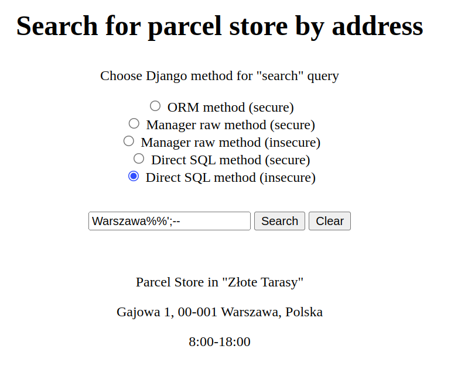
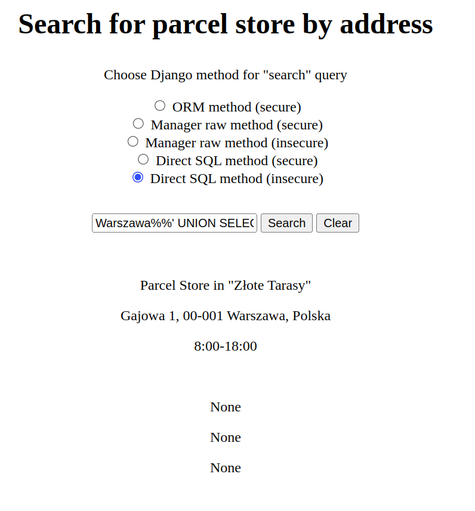
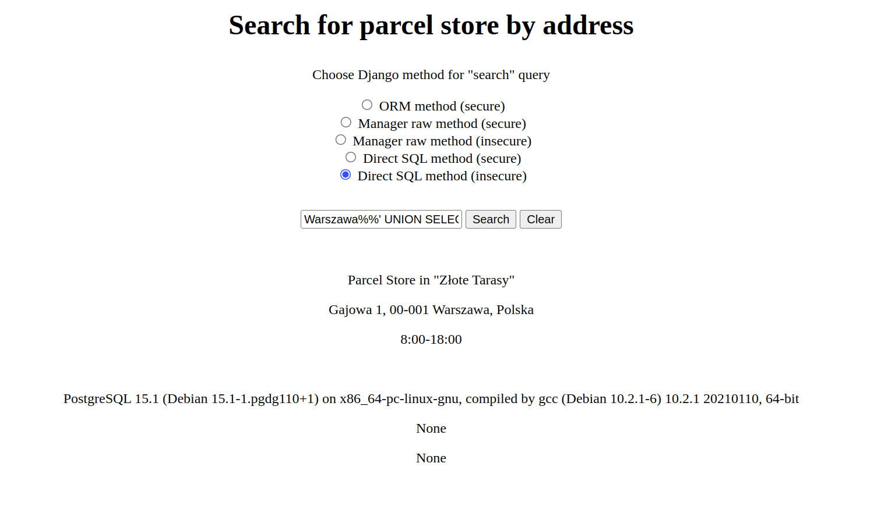
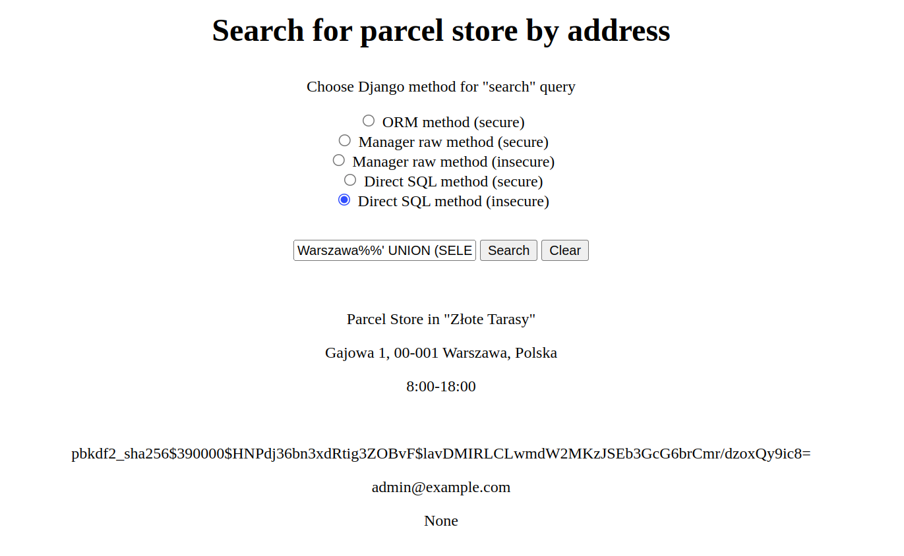
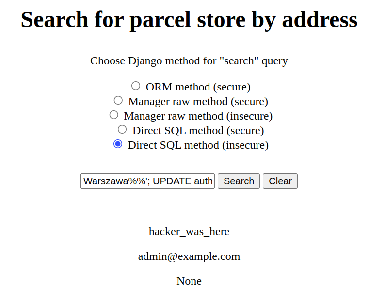

# 1. Introduction
This project is focused on showing one of the cybersecurity attack: SQL Injection, so other
vulnerabilities like not using ssl certificates, etc. are not considered.

# 2. What is a SQL Injection attack
Resource: https://owasp.org/www-community/attacks/SQL_Injection

A SQL injection attack consists of insertion or “injection” of a SQL query via the input data from the client to the application. A successful SQL injection exploit can read sensitive data from the database, modify database data (Insert/Update/Delete), execute administration operations on the database (such as shutdown the DBMS), recover the content of a given file present on the DBMS file system and in some cases issue commands to the operating system. SQL injection attacks are a type of injection attack, in which SQL commands are injected into data-plane input in order to affect the execution of predefined SQL commands.

# 3. How to prevent SQL Injection attack
To prevent SQL Injection attack it is crucial to escape user input in the query, so it is not
treated as a SQL command, but as a parameter in the query. To achieve that, statement needs to be
prepared in the way that database engine knows which part should be treated as a command and which
should be treated as the query parameter. Most of the modern languages and frameworks provides such
mechanism.

# 4. Local setup for demo
## 4.1 Requirements
- Docker version 20.10.18
- docker-compose version 1.29.2

Project was developed with these versions of docker, but previous versions should also work.

## 4.2 Setup steps
1. Download this repository
2. Run `./bin/build_image` which downloads and builds required docker image(it may take a moment)
3. Run `./bin/run_app` which builds database and starts Django monolith application.
It may need rerun after first time, because of db building while backend depends on it.
4. Run `./bin/load_demo_data` to load demo data.

Now app should be accessible at http://localhost:8000.

# 5. Demo scenarios
Demo site is simple mockup page of fake carrier that provides user with view to search for parcel
stores where customer can receive their package. Site was created using Django framework.
For the sake of SQL Injection demo user can select what Django method he wants to use to query
database from the 5 available options:
- Django ORM which is always secure
- Django manager raw method implemented in secure way
- Django manager raw method implemented in **insecure** way
- Direct database connection with query passed as string method implemented in secure way
- Direct database connection with query passed as string method implemented in **insecure** way

More info about these methods can be found in section 6

## 5.1 Using one of the insecure methods
In the first scenario actor can use any of two insecure methods, but let's just assume that the
demo site use one of these methods by default. We can see that the input allows us to filter parcel
stores by address. Let's try to recreate the reasoning and actions attacker performs when he wants
to exploit potential SQL Injection vulnerability. First he needs to know whether input is
vulnerable to SQL Injection. Assuming that `Warszawa` returns one record, let's try to escape the
query parameter, close the query and comment the rest with `Warszawa';--` input. `'` sign should
escape string quotes in which parameter is put, `;` sign declares the end of the query and `--`
declares the one line comment in most implementations of SQL. It does not work. Analyzing the
search mechanism we can conclude that probably `WHERE LIKE '%parameter%` is used to match words
inside the address string. Let's try to pass `Warszawa%';--`. It also does not work and it raises
error. `%` may be special character for string in many languages. We may need to escape it.
It can be escaped in many ways, but it occurred that `%%` works, so the final query is
`Warszawa%%';--`. Bingo. Now we may be sure that search box is vulnerable to SQL Injection, because
parcel store's address does not contain the search phrase. We just escaped the parameter,
closed the query and commented the rest.

Having that knowledge we can go step further. Let's try to experiment with SQL `UNION` command.
The idea behind it is that it should "union" two query results into one under two conditions:
number of returned values must match and values in the same column of different tables must have
the same type, unless it is `NULL` value. We will use this `NULL` value exception to check how many
values are returned in the query. On the search results we can see three paragraphs, so it is
logical to conclude that query returns three values. Let's try 
`Warszawa%%' UNION SELECT NULL, NULL, NULL; --`. It does not work and site crashes.
Maybe some field is not displayed, let's try it with one more
`NULL`: `Warszawa%%' UNION SELECT NULL, NULL, NULL, NULL; --`. Yaay(not yaay for fake carrier),
that is working.

.

Now it may be useful to know on what database we are operating. Most of the modern database
provides some kind of command to check it. Let's skip part of guessing and with the knowledge
that this app is using postgres let's search for
`Warszawa%%' UNION SELECT NULL, version(), NULL, NULL; --`.

Now that we know we are operating on postgres we may want to check for tables and columns of that
tables. For the tables we need to query postgres specific table of tables and for the `table_name`
column in that table:
`Warszawa%%' UNION (SELECT NULL, table_name, NULL, NULL FROM information_schema.tables); --`.
Wow, now we have some information. Table `auth_user` seems to be interesting, let's see what
columns are on that table using
`Warszawa%%' UNION (SELECT NULL, column_name, NULL, NULL FROM information_schema.columns 
WHERE table_name = 'auth_user'); --`. `password` and `email` seems to be really secret data
even if password is hashed, let's check that with
`Warszawa%%' UNION (SELECT NULL, password, email, NULL FROM auth_user); --`.

Bazzinga, now practically we have access to the whole database. We may want to crack the hash for
the admin password, but it may take a long time(longer than hacker lifetime) if the hash is not in
the rainbow table and algorithms are secure. We may also want to search the database for other
sensitive information, but we may also have some fun and just change the password for the admin :)
Standard SQL `UPDATE` command does not return changed values, but to fit into 4 values we may use
a trick with `RETURNING` command to return altered columns. Let's try
`Warszawa%%'; UPDATE auth_user set password = 'hacker_was_here' WHERE email = 'admin@example.com' 
RETURNING id, password, email, NULL; --`.

## 5.2 Using one of the secure methods
We may want to try the same path and search with queries from the previous subsection, but it will
not work. Simply because search text cannot be escaped, queries are parametrized and expect user
input only in specified places. All the queries from the previous subsection will be treated as
plain text and will not match any parcel store address.

# 6. So how does it work?
To query database in Django you may use three methods: ORM, manager raw methods and direct SQL.
The first one is always safe and the other two safety depends on the usage of these methods. That
is why Django ORM is always advised option to communicate with database.

## 6.1 Django ORM
In this case it is pretty straightforward. Django documentation advises usage of ORM methods,
because they are fully secure and cannot be implemented in insecure way. Each query is
parametrized by default. Usage of ORM for searching for parcel store address can be seen in
`parcel_store.utils.get_parcel_stores_filtered_by_address_with_orm`.

## 6.2 Manager raw method
Using manager raw method is not advised in Django documentation, because query is passed
as string and parametrization is optional. It may be implemented in the way that parameter provided
by user is injected in the query by simple python string formatting. In that way database engine
will treat the whole string as a query which is insecure, because it contains user input which is
not parametrized. You can see insecure usage of manager raw method in
`parcel_store.utils.get_parcel_stores_filtered_by_address_with_manager_raw_insecure`.

On the other hand, manager raw method provides mechanism for parametrization and it is completely
safe, you can see implementation here
`parcel_store.utils.get_parcel_stores_filtered_by_address_with_manager_raw_secure`.

## 6.3 Direct SQL
Direct SQL works in the same way in terms of parametrization. You pass the query as a string and
parametrization of that string is optional. The only difference between these methods is in what
they return. Manager raw serialize result to queryset of model objects, where direct sql returns
pure values in list. You can see secure implementation of direct SQL connection in
`parcel_store.utils.get_parcel_stores_filtered_by_address_with_direct_sql_secure` and insecure in
`parcel_store.utils.get_parcel_stores_filtered_by_address_with_direct_sql_insecure`.
